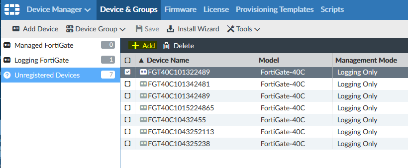
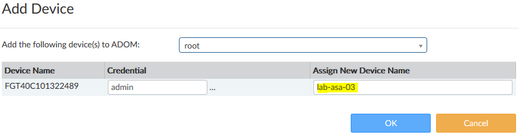
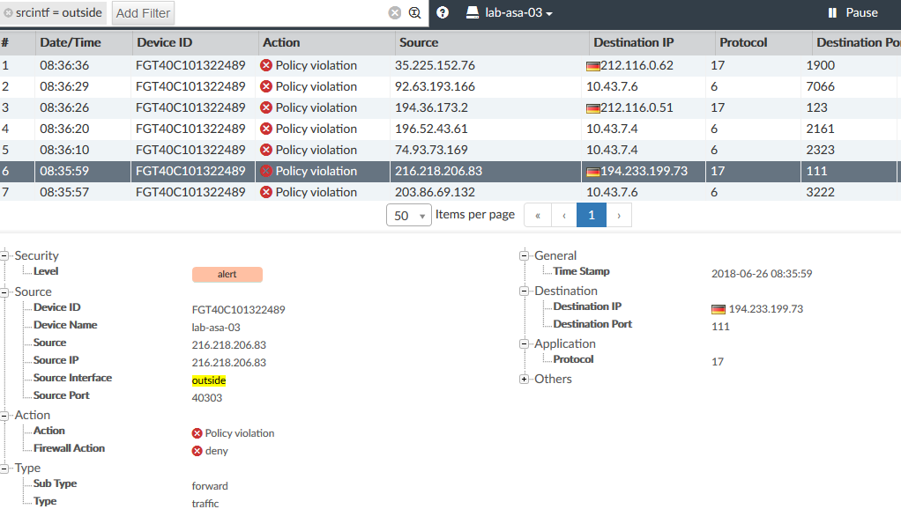
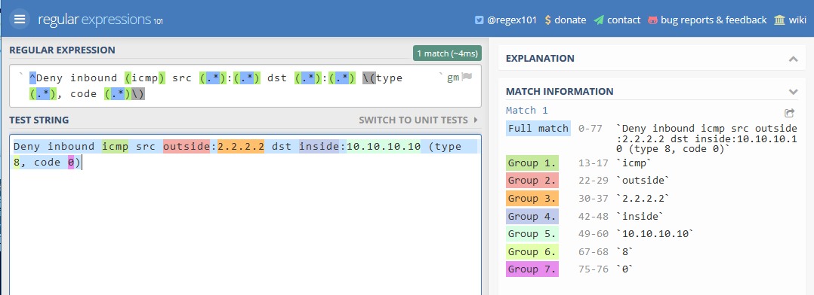

# syslog2faz
convert syslog of legacy firewalls to a structured FortiAnalyzer compatible format

# What does it do?
This tool receives verbose syslog from Cisco ASA firewalls, parses them on the fly and forwards them to a FortiAnalyzer (FAZ).
The FAZ sees an unregistered device that can be named and used similar to a FortGate.  

This tool was done to see if it is possible to use the FAZ for consolidated logs of our legacy devices. Currently the FAZ is tricked by faking the device ID. 

# Usage
Simply start the binary and provide the FAZ IP or name

     ./syslog2faz -f 10.10.10.100
Listen on default port 10514 and forward to FAZ with IP 10.10.10.100
In addition you can tweak some parameters

     -p lstening port
     -t test regular expressions
     -f FortiAnalyzer IP or name
     -c configuration file location

# Configuring the Cisco ASA
On the ASA you need to provide the IP of the tool as a logging host

     logging host <interface name> <syslog2faz ip> 17/10514

# On the FortiManager / FortiAnalyzer
First you see the logging firewalls as "Unregistered Devices". They all look like 40Cs with a device name that is the ip address without dots. So an ASA with management IP 10.10.10.10 would be named FGT40C10101010. Now select the device press the "Add" button.

Name the box and click "OK".
You don't need to provide credentials, but you can move it to another ADOM if needed.

As a result you have a device, where you can filter on logs, like you can do with FortiGates!

# Under the hood: The parser
The tool needs a filter file to parse the terribly verbose and inconsistent Cisco logs. That file contains the regular expressions for several message ids, the meaning of the parsed values and test patterns to assure that the filters work. I created patterns for the first logs I found, but this file should grow in the future. Therefore I created a compact format, where I hope that others might be able to add filters on their own.
It looks like this.
1. line: the message id, something that you see as ASA-4-106023
2. line: the regular expression that matches important parameters
3. line: the list of names of the matched parameters
4. line: extra key/values
5. line: a test pattern
6. line: the expected test results

       106023
       	^Deny (tcp|udp) src (.*):(.*)/(.*) dst (.*):(.*)/(.*) by access-group ".*" .*
       	proto;srcintf;srcip;srcport;dstintf;dstip;dstport
       	action=deny;type=traffic;subtype=forward
       	Deny udp src inside:10.10.10.10/12345 dst outside:2.2.2.2/80 by access-group "global" [0x0, 0x0]
       	udp;inside;10.10.10.10;12345;outside;2.2.2.2;80

A nice tool to test regular expressions is https://regex101.com/ 

Here you see Regex, the test string an the matches of the test string. We search for 7 parameters that must be named, for example "proto" or "srcintf". As extra we need to say that this is a message of type "traffic" and the packet is denied. The section to parse this message looks like this.

    ^Deny inbound (icmp) src (.*):(.*) dst (.*):(.*) \(type (.*), code (.*)\)
    proto;srcintf;srcip;dstintf;dstip;icmptype;icmpcode
    action=deny;type=traffic;subtype=forward
    Deny inbound icmp src outside:2.2.2.2 dst inside:10.10.10.10 (type 8, code 0)
    icmp;outside;2.2.2.2;inside;10.10.10.10;8;0

If you modify the filter.list file you should run

     ./syslog2faz -t
afterwards.

# Suggestion to Fortinet
This current solution only works because of the fiddled device id. I would like to have a proper log identifier for 3rd party devices. Maybe "devid=UNSUPPORTED" or "devid=THIRDPARTY".
The FAZ still needs a license for this "managed" device, so you don't give something away for free.
